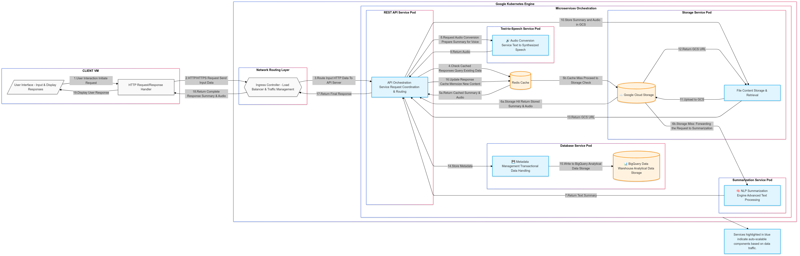

# Wikipedia Articles Summarization and Conversion to Audio

## About the Project
This project, "Wikipedia Articles Summarization and Conversion to Audio," uses advanced NLP and audio processing technologies to enhance the accessibility and convenience of consuming information from Wikipedia. By summarizing extensive articles and converting those summaries into audio format, this service benefits auditory learners, individuals with visual impairments, and anyone seeking quick insights from lengthy Wikipedia entries.

## Project Team- Team 61
- **Jagadeesh Nadimpalli** - Project Lead, responsible for system architecture, backend development, and integration of services.
- **Deepak Kandikattu** - Co-developer, assisted with frontend development and testing of the system.

## Key Features
- **Time-Efficient Content Consumption**: Automatically extracts and condenses articles, enabling quick comprehension of key information.
- **Enhanced Accessibility**: Converts text summaries into audio, making information accessible in a more inclusive format.
- **Multi-Functional System**: Supports article input, summary customization, and audio playback control, adaptable to various user needs.
- **Scalable Architecture**: Built on Kubernetes, ensuring reliable performance and scalability under varying loads.
## Project Architecture

## Technologies Used
- **Flask**: Manages web application backends and handles HTTP requests.
- **Transformers and Beautiful Soup**: Powers NLP tasks and scrapes web content.
- **Google Text-to-Speech (gTTS)**: Converts text summaries into spoken audio.
- **Redis**: Improves response times through result caching.
- **Google Cloud Storage (GCS)**: Stores and retrieves large data files.
- **Google Cloud BigQuery**: Analyzes and manages metadata.
- **Google Kubernetes Engine (GKE)**: Deploys and manages containerized applications.
- **Docker**: Ensures consistent environments through containerization.

## Getting Started

### Prerequisites
- A Google Cloud Platform account.
- Kubernetes set up on Google Cloud.
- Docker installed on your local machine.
- Google Cloud SDK installed and configured on your machine.

### Installation

#### Initial Setup
Execute the `main.sh` script to set up your environment. This script will handle project ID setting, API enabling, service account creation, role assignments, and more. Here is what each command in the script accomplishes:

1. **Set Project ID**: Configures your GCP environment to use a specified project ID.
2. **Enable APIs**: Enables necessary GCP APIs such as Compute Engine, Kubernetes Engine, etc.
3. **Create a Service Account**: Establishes a service account to manage operations with defined permissions.
4. **Assign Roles**: Applies necessary roles to the service account for operations across GCP services.
5. **Generate a Key for the Service Account**: Produces a JSON key file for service account authentication.
6. **Export Key**: Sets the GOOGLE_APPLICATION_CREDENTIALS environment variable to authenticate with your service account.
7. **Create Kubernetes Cluster**: Initializes a Kubernetes cluster with autoscaling configured.
8. **Store Cluster Credentials**: Configures `kubectl` to use credentials for the newly created cluster.
9. **Check Nodes**: Confirms the nodes within the Kubernetes cluster are correctly set up.
10. **Authenticate Docker with GCR**: Sets up Docker to push and pull images from Google Container Registry.

#### Using the Script
To run the setup script, navigate to the directory containing `main.sh` and execute the following command:
```bash
./main.sh
```
Make sure you have execution permissions set on the script:
```bash
chmod +x main.sh
```
After completing the project use `deletion_commands.sh` script to delete the resources created for project
```bash
./deletion_commands.sh
```

### Modifications
- **Project ID**: Replace `<your-project-id>` with your actual Google Cloud project ID in the script.
- **Service Account and Roles**: Ensure the roles and permissions align with your project's security requirements.
- **Cluster Configuration**: Adjust the Kubernetes cluster setup parameters according to your specific needs, such as changing the machine type or the number of nodes.

### Service Setup
Each service within the project has its own folder containing a specific README with detailed setup instructions. Please refer to these READMEs for service-specific configurations:
- [REST API Service](rest/README.md)
- [Summarization Service](Summarization/README.md)
- [Text-to-Speech Service](TTS_service/README.md)
- [Database Service](Database/README.md)
- [Storage Service](Storage/README.md)
- [Redis_Service](Redis/README.md)
- [Frontend Service](Frontend/README.md)

## Usage
Access the frontend via the deployed virtual machine's IP to interact with the system. Input a Wikipedia article URL or search term, specify the desired summary length, and receive a summarized audio output.

## Contributing
Contributions are what make the open-source community such an amazing place to learn, inspire, and create. Any contributions you make are greatly appreciated.
1. Fork the Project
2. Create your Feature Branch (`git checkout -b feature/AmazingFeature`)
3. Commit your Changes (`git commit -m 'Add some AmazingFeature'`)
4. Push to the Branch (`git push origin feature/AmazingFeature`)
5. Open a Pull Request

## Contact
- Jagadeesh Nadimpalli - [Jagadeesh.Nadimpalli@colorado.edu](mailto:Jagadeesh.Nadimpalli@colorado.edu)
- Deepak Kandikattu - [deka4633@colorado.edu](mailto:deka4633@colorado.edu)

## Acknowledgements
- Hugging Face Transformers
- Google Cloud Platform
- Docker Community

## Conclusion
This project demonstrates the effective use of modern technologies to simplify the consumption of information from one of the world's largest knowledge repositories, Wikipedia. By integrating NLP and audio processing tools, it addresses significant accessibility challenges, making knowledge consumption more efficient and inclusive.
