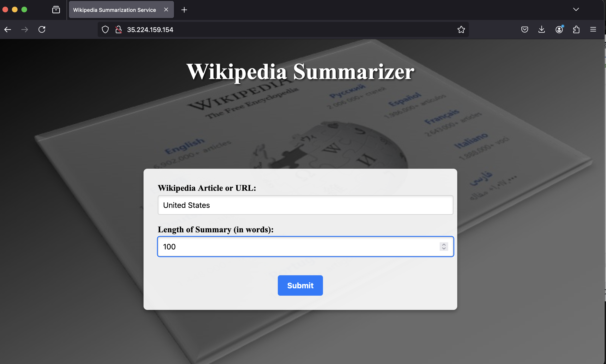
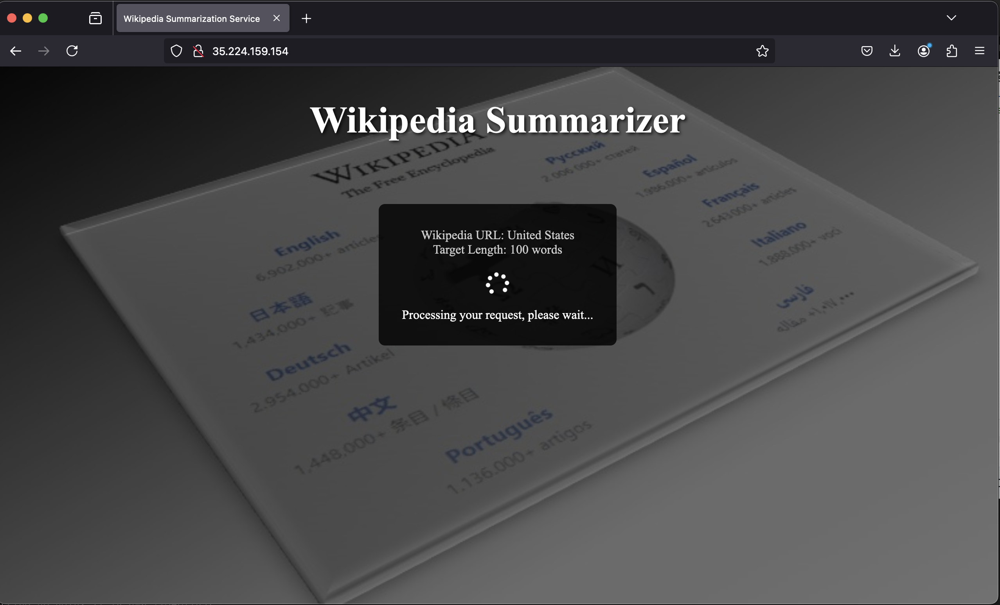
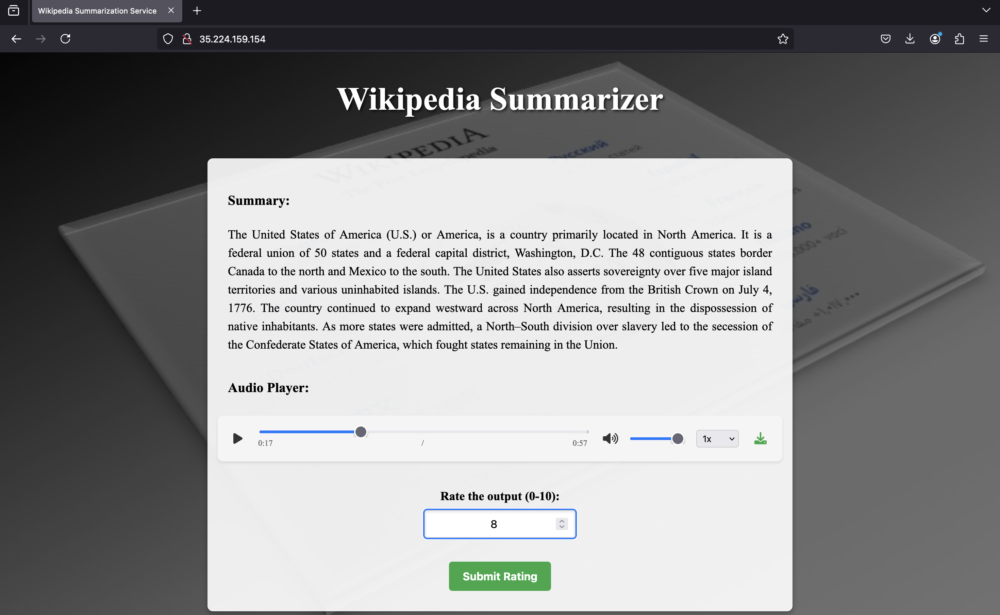
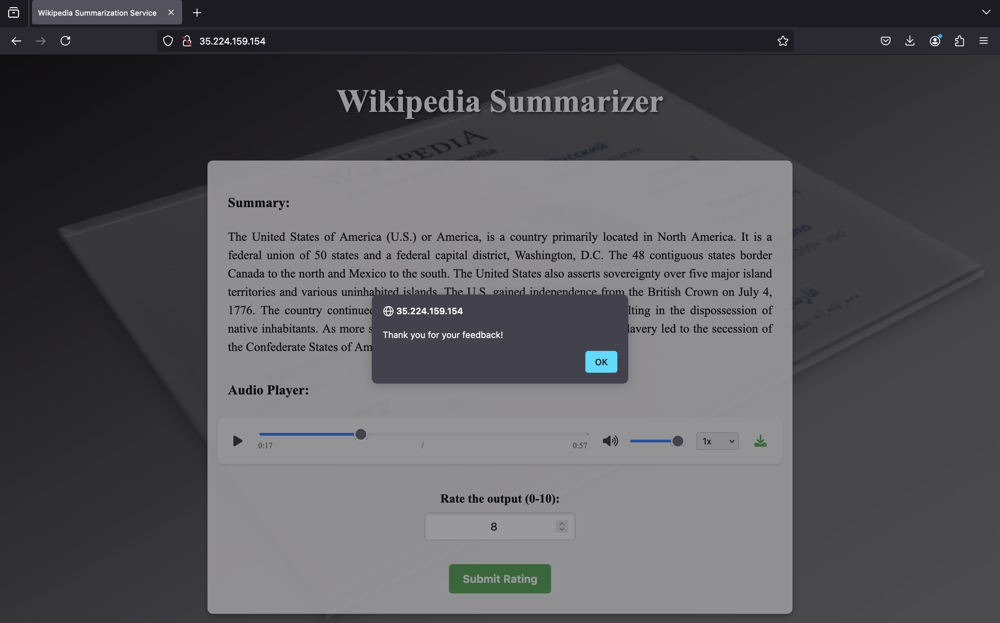
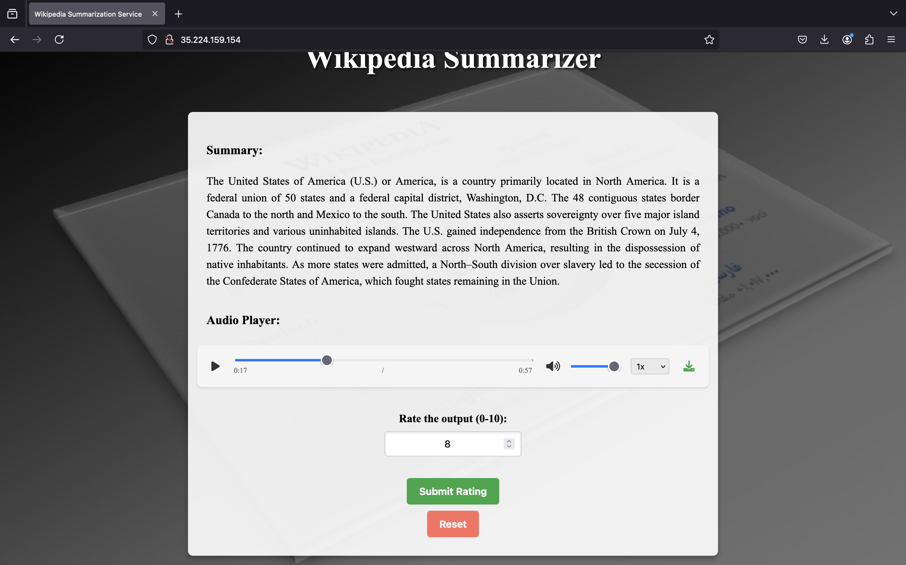

**1. Accessing with VM Instance External Ip address:**

**2. Request Processing at backend:**

**3. Response message displayed on UI:**

**4.Feedback message when submit rating:**

**5.Reset button, when user wants to retry: **

